---

## ✦ Featured Projects
 
<table>
<tr>
<td width="33%" valign="top" align="center">

 
**Productivity system for web, CLI &amp; MCP**
 
Tasks, goals and notes with GitHub/Jira sync and AI-agent tooling.
 
  
 
</td>
<td width="33%" valign="top" align="center">

 
**Multi-agent workspace for Claude Code**
 
Parallel agents, isolated Git worktrees, shared context and coordination.
 
 
 
</td>
<td width="33%" valign="top" align="center">

 
**Voice-controlled oversight for agents**
 
Catch blocked sessions and approve, deny or investigate hands-free.
 
 
 
</td>
</tr>
</table>

### Also building
 

🩻 Keepwell versions prescriptions, labs and records &nbsp;·&nbsp; 💧 Water Tracker nags you into hydrating, 600+ users and counting &nbsp;·&nbsp; 🧪 HarMock turns HAR traffic into mock APIs
 
🐿️ Milo is an AI squirrel who judges your spending &nbsp;·&nbsp; ⌨️ Terminal Box saves and shares your shell commands &nbsp;·&nbsp; 🎙️ SpeakSurf drives Chrome by voice &nbsp;·&nbsp; 📖 Quran Tutor schedules and tracks lessons

---

## What I Work On

| Area | Focus |
|---|---|
| **Kubernetes Platform** | EKS lifecycle, upgrades, node capacity, Karpenter, KEDA and workload reliability |
| **Infrastructure as Code** | Terraform-driven infrastructure across isolated environments and AWS services |
| **Reliability & Observability** | CloudWatch, Prometheus, Grafana, alerting and production incident investigation |
| **DevSecOps** | IAM, workload identity, secrets, SOC 2 controls and secure delivery |
| **Platform Engineering** | Automation, reusable infrastructure patterns and reducing developer toil |
| **Cost & Efficiency** | Spot capacity, autoscaling, storage lifecycle and infrastructure optimization |

🧑‍🏫 CKAD certified · co-led Easygenerator's SOC 2 compliance · previously mentored DevOps engineers at IBM
 
Outside the terminal: 🏃 Running · 📸 Landscape & abstract photography · 📖 Psychology books · 🧘 Meditation

---

## Platform & Infrastructure

<b>CURRENT CORE</b>

<b>RELIABILITY, DELIVERY & SECURITY</b>

<b>BROADER PLATFORM EXPERIENCE</b>

---

## Side Quest Stack
 
| | |
|---|---|
| **Web** | TypeScript · React · NestJS · Tailwind · shadcn/ui · Vite · Prisma |
| **Mobile** | React Native · Expo · Convex |
| **Desktop** | TypeScript · React · Electron |
| **CLI** | Go · Cobra · Bubble Tea |
 
<code># TODO: stop starting new side projects</code>

---

## Connect
 
Happy to talk Kubernetes, platform engineering, or agent tooling.
 

 
  
 

 

